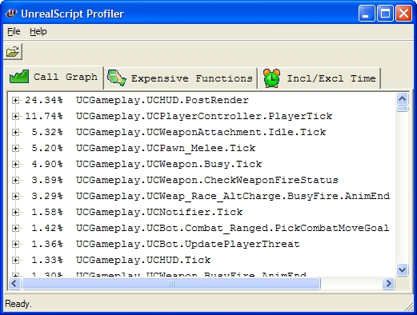

UnrealScript can be a confusing place, not only in terms of what is executing when but also in terms of what is taking the biggest bite out of your frame rate. This is where the profiler utility can help the most!



## Creating a Profile

You can start profiling any time by entering:

```clike
PROFILESCRIPT START
```

And stop it by typing:

```clike
PROFILESCRIPT STOP
```

The latter will create a `KillingFloor-<Current ISO Date>.uprof` file in your `KillingFloor\System\` folder which can then be viewed by the visualizer.

## Output

When you load a data file, you'll be presented with several tabs worth of information. They contain the information outlined below.

### Call Graph

Percentages numbers are total inclusive time with "self" representing total exclusive time if the function is not a leaf. The call graph data gets collected as a stream of function calls and time of function return for each call so unlike most call graph profilers the visualizer doesn't have to rely on the "average time assumption". Timing issues and bugs in the visualizer aside, the data should be entirely representative of the time spent executing script code.

### Expensive Functions

This view shows a tree of function calls sorted by absolute inclusive time (in usec) per call for the top nodes and absolute inclusive time per top node call for child nodes. This allows drilling down into expensive functions which is useful for improving worst case frame times. E.g. consider a function taking 10ms per call though only being called once every 100 frames. This means 0.1ms per frame which doesn't show up as a spike in regular profiling but is most likely very noticeable during gameplay.

### Incl / Excl Time

The inclusive/ exclusive tab displays the inclusive/ exclusive percentages, number of calls and inclusive/ exclusive times per call in a compact fashion. All times are in usec (one millionth of a second).

### How the Profiler Works

The backend gathers a function pointer for each call to a "script" or "native function" from script and the inclusive time spent in each call to the function. The data is collected as a stream of function pointers on function entry and inclusive time on function return, hence allowing perfect reconstruction of the call graph.

The data is parsed by an external C# frontend which includes several options to visualize the prepared data.

## Summary

This profiling utility will become your best friend for finding performance bottlenecks within your UnrealScript? classes.

Have fun!

- [**ut2004.uprof**](https://github.com/InsultingPros/LazyKFWiki/releases/download/1.0.0/ut2004.uprof): Sample script profiling output from UT2004.
- [**ueScriptProfiler.exe**](https://github.com/InsultingPros/LazyKFWiki/releases/download/1.0.0/ueScriptProfiler.exe): Script profiler binary.

## Source

<https://docs.unrealengine.com/udk/Two/ScriptProfiler.html>
